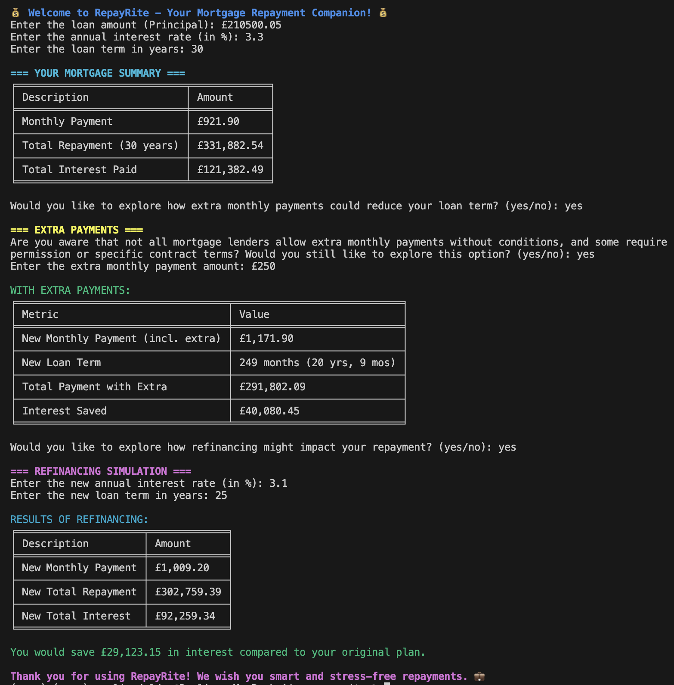
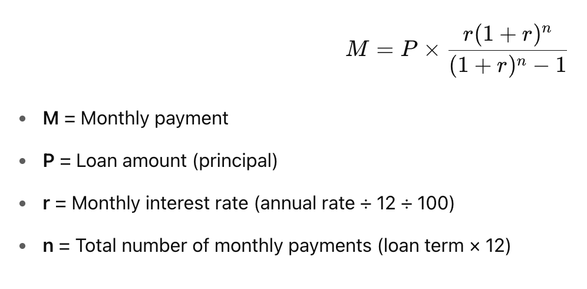
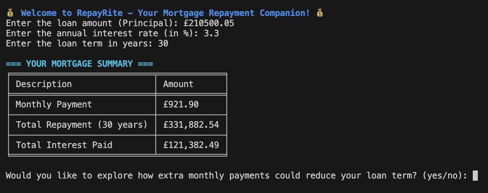
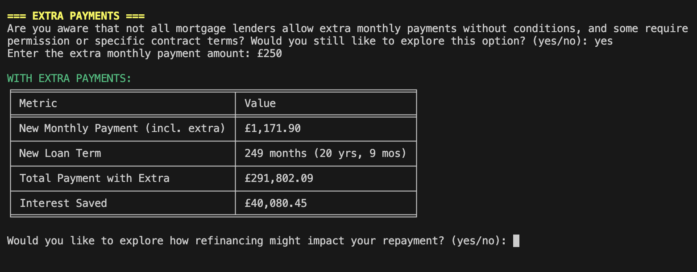
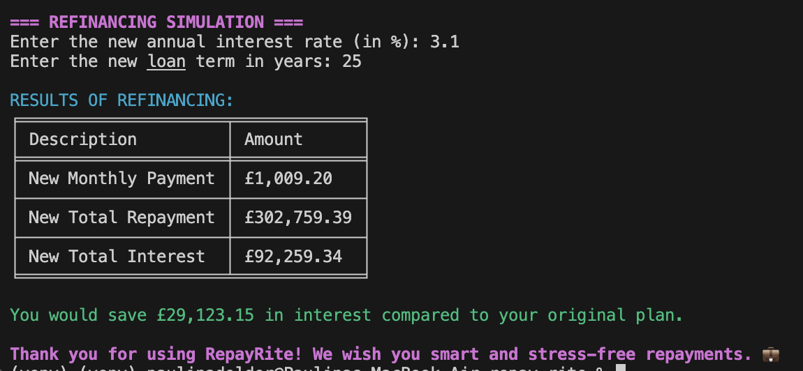
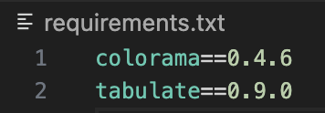

# RepayRite

RepayRite is a command-line mortgage calculator designed to help users easily understand and manage their mortgage repayments. Through clear prompts, color-coded output, and tabulated financial summaries, it empowers users to explore standard repayments, extra payment scenarios, and refinancing options—all within a terminal interface.

---

## Table of Contents

- [UX](#ux)  
  - [Target Users](#target-users)  
  - [User Needs Addressed](#user-needs-addressed)  
- [Goals](#goals)  
  - [User Goals](#user-goals)  
  - [Developer Goals](#developer-goals)  
- [Visual Design](#visual-design)  
- [Features](#features)  
  - [Core Features](#core-features)  
  - [User Journey](#user-journey)  
- [Feature Ideas](#feature-ideas)  
- [Technologies Used](#technologies-used)  
- [Testing](#testing)  
- [Deployment](#deployment)  
  - [Local Deployment](#local-deployment)  
  - [GitHub Deployment (via Heroku)](#github-deployment-via-heroku)  
- [Credits](#credits)  
- [Contact](#contact)

---

## UX

**RepayRite** is a command-line mortgage calculator designed to help users make informed decisions about their mortgage repayments. The interface is styled using color and tables to enhance usability, provide clarity, and deliver a professional experience. 

### Target Users

- First-time homebuyers exploring affordability
- Existing homeowners considering overpayments
- Borrowers curious about refinancing options
- Anyone seeking transparency around total repayment costs

### User Needs Addressed

- **Simplicity**: Step-by-step prompts guide the user clearly through each calculation process.
- **Transparency**: The app displays exact monthly payments, total interest paid, and overall repayment costs in a clear format.
- **Awareness**: The app includes realistic prompts to inform users that not all lenders allow extra payments without conditions.
- **Visual Clarity**: Using the `colorama` and `tabulate` libraries, results are color-coded and formatted in clean tables to improve readability in the terminal.

The user experience prioritises clarity, safety, and empowerment, especially for users who may be unfamiliar with mortgage

---
## Goals

The primary goal of **RepayRite** is to support users in understanding and managing their mortgage repayment journey through clear, accurate, and accessible terminal-based tools.

### User Goals

- Calculate standard monthly repayments based on inputted loan amount, interest rate, and loan term.
- Understand the long-term cost of the mortgage, including total interest and total repayment.
- Simulate how making **extra monthly payments** could reduce the overall loan term and interest paid.
- Explore **refinancing scenarios** to see how a new interest rate or loan term might improve or worsen repayment costs.
- Receive all results in a clean, color-enhanced, and table-formatted layout for easy interpretation.

### Developer Goals

- Build a modular and maintainable codebase using clean functions.
- Apply external Python libraries (`colorama`, `tabulate`) to enhance UI/UX in the command line.
- Include realistic prompts to educate users about mortgage conditions (e.g., limitations on overpayments).
- Ensure the application is **deployed and functional via Heroku**, and that it is accessible with no local setup required.

---
## Visual Design

- **Color Coding**: The `colorama` library is used to highlight key sections, warnings, results, and user prompts. For example:
  - Blue for headers and welcome messages.
  - Green for positive financial outcomes or savings.
  - Red for warnings, errors, or increased costs.
  - Yellow and magenta for informative sections.
  
- **Tabular Output**: The `tabulate` library formats key financial figures into clean, easy-to-read tables using the `fancy_grid` style, enhancing readability.

- **Emoji Use**: Relevant emojis are incorporated during the welcome and goodbye messages to add personality and enhance user engagement, maintaining consistency throughout the interaction.

- **Whitespace & Sectioning**: Clear separation between input sections and results improves the flow of interaction, preventing cognitive overload.

- **Minimal Input, Maximum Clarity**: Users are only asked for essential inputs (e.g., loan amount, interest rate, term). Complex results are computed and displayed clearly, without requiring users to interpret raw math.

- **Accessibility Considerations**: 
  - All prompts and results are printed in plain English.
  - Symbols (like £ and %) are used consistently.
  - Tables prevent misreading or confusion around financial metrics.

This approach ensures RepayRite delivers a smooth user experience, even in a non-graphical environment.

---
## Features

RepayRite includes multiple core features designed to help users better understand and manage their mortgage repayments.

### Core Features

- **Monthly Repayment Calculator**
  - Calculates standard monthly repayments based on user input (loan amount, interest rate, and term).
  - Displays monthly payment, total repayment, and total interest in a formatted table.
  - The monthly mortgage repayment is calculated using the standard formula used by financial institutions:
 

- **Extra Monthly Payment Simulation**
  - Allows users to simulate how paying more each month can reduce the loan term and total interest paid.
  - Provides warnings that some lenders may require permission for extra payments.
  - Outputs updated repayment figures in a clearly tabulated format.

- **Refinancing Simulation**
  - Lets users enter a new interest rate and/or loan term to simulate refinancing scenarios.
  - Compares new repayment values to the original plan, highlighting potential savings or extra costs.

  

- **Clear Output and Styling**
  - Uses `colorama` for color-coded output to highlight warnings, savings, and key information.
  - Uses `tabulate` to present financial metrics in professional, easy-to-read tables.

- **User Guidance and Validation**
  - Input prompts are phrased in friendly, clear language.
  - Invalid inputs (e.g. text instead of numbers) are caught and handled with helpful error messages.

- **Reusable Design**
    - Functions are modular and separated in `calculator.py` for easy maintenance or expansion.
    - Easy to extend the app with future enhancements like overpayment limits or early exit fees.

### User Journey

The user experience follows a logical path:

1. Welcome message.
2. Enter mortgage details.
3. View a breakdown of repayment details.
4. Optional: simulate extra monthly payments.
5. Optional: explore refinancing scenarios.
6. Receive a closing message of support.

This combination of functionality and guidance makes RepayRite practical, educational, and user-friendly.

---
## Future Ideas

The following are potential future enhancements that could improve RepayRite’s functionality, user experience, and real-world accuracy:

### Web Interface
- Build a graphical user interface (GUI) using `tkinter` or deploy a web version using Flask/Django.
- Allows broader accessibility and ease of use for users less familiar with the command line.

### Provider Comparison Tool
- Add functionality to compare mortgage offers from different banks or lenders.
- Could include APIs or mock datasets for rates, terms, and fees.

### Early Repayment Charge Estimator
- Calculate penalties for early repayment if applicable, based on percentage or flat fee.
- Warn users if their overpayment triggers these fees.

### Mortgage Overpayment Tracker
- Allow users to simulate overpayments across a custom schedule (e.g., £500 extra every 6 months).
- Display visual projections of balance reduction over time.

### Data Visualization
- Integrate libraries like `matplotlib` to generate charts for:
  - Amortization schedules
  - Interest vs. principal over time
  - Savings from overpayments/refinancing

### Save/Export Results
- Let users save session results as `.txt` or `.csv` files.
- Enables better personal record-keeping and budgeting.

These ideas were not implemented in the current version in order to stay focused on core functionality and meet the scope of a CLI-based educational project, but they form a solid roadmap for future iterations.

---
## Technologies Used

RepayRite was built using a range of tools and technologies to support clean, modular code and functional deployment.

### Languages
- **Python 3.12**  
  Primary language used for all logic, calculations, and CLI interaction.

### Frameworks
- **None used**  
  As this is a command-line interface (CLI) project, no web or GUI frameworks were needed.

### Libraries
- **[Colorama](https://pypi.org/project/colorama/)**  
  Used to style terminal output with colors and emphasis for better user experience.
- **[Tabulate](https://pypi.org/project/tabulate/)**  
  Used to format data into visually appealing tables in the console.

### APIs
- **None used**  
  All functionality is self-contained and does not rely on third-party APIs.

### Platforms
- **macOS (Development Environment)**  
  The app was developed and tested locally using macOS terminal.
- **Heroku (Deployment Platform)**  
  The live app was deployed and made accessible online via Heroku's free tier.

### Other Tools
- **VS Code**  
  Used as the primary code editor throughout development.
- **Git**  
  For version control, branching, and commits.
- **GitHub**  
  To host the code repository and manage version history.
- **pip**  
  Used to install and manage external libraries (Colorama and Tabulate).
- **Python Virtual Environment (`venv`)**  
  Used to isolate dependencies and keep the development environment clean.

---
## Testing

Testing was a crucial part of the development process to ensure the application performs reliably and handles errors gracefully.

### Methods

- **Manual Testing:**  
  The application was thoroughly tested via the command-line interface with a variety of inputs, including valid and invalid data. This helped uncover issues such as incorrect calculations and input handling problems early in development.

- **Built-in Error Handling:**  
  Input validation was implemented with `try-except` blocks to catch invalid or non-numeric entries, preventing crashes and providing user-friendly error messages.

- **Early Deployment Testing:**  
    - The first deployment was implemented after the basic skeleton and core logic worked correctly on the local machine.
    - Subsequent deployments followed each major feature addition or significant code functionality update.
    - Deployment was re-tested after the entire codebase was completed.
    - A final deployment check was done after visual styling was applied to ensure the app functioned correctly in its deployed environment.

---
### Bugs:

- **Initial deployment:**  
  An initial deployment attempt encountered issues due to the `Procfile` generated by Code Institute’s template conflicting with the project’s needs. After removing the conflicting Procfile settings, deployment succeeded.

- **Loop Termination Fix:**  
  In the extra payments calculation, a potential infinite loop was identified if the extra payment amount was insufficient to reduce the principal. This was fixed by adding a break condition when no principal reduction occurs.

- **Mathematical Logic Bugs:**  
  Manual testing revealed that some mortgage calculations did not add up correctly initially, especially in the refinancing and extra payment scenarios. These issues were traced to calculation logic errors and were corrected to ensure accurate output.

Overall, these testing efforts helped refine the application, improve user experience, and ensure reliability before final deployment.

---
## Deployment

### Local Deployment

**Preperation and Requirements:**

- Python 3 installed on your system  
- An IDE or code editor such as Visual Studio Code  
- Git (to clone the repository)  
- A terminal or command prompt to run the application  

#### Local Instructions

To run the project locally, follow these steps:

- Clone the project repository from GitHub:  
  `git clone https://github.com/PaulinaD-CodeIns/repay-rite`

- Navigate into the project directory:  
  `cd repay-rite`

- (Optional but recommended) Create and activate a virtual environment:  

  - On macOS/Linux:  
    - `python -m venv venv`  
    - `source venv/bin/activate`

  - On Windows:  
    - `python -m venv venv`  
    - `venv\Scripts\activate`

- Install the required packages listed in `requirements.txt`:  
  `pip install -r requirements.txt`

- Run the application:  
  `python main.py`

The application will launch in your terminal and guide you through mortgage repayment calculations using a CLI interface.

---
### GitHub Deployment (via Heroku)

This project has been deployed to Heroku using GitHub integration.

#### GitHub Preparation

You will need:

- A free GitHub account  
- A free Heroku account  

#### Heroku Deployment Instructions

- Push your complete, working code to GitHub in a public repository:  
  https://github.com/PaulinaD-CodeIns/repay-rite

- Log into your Heroku Dashboard.

- Click **New** → **Create New App**, and give it a unique name (e.g., `repayrite-calculator`).

- Under **Deployment Method**, choose **GitHub** and connect it to your repository:  
  `PaulinaD-CodeIns/repay-rite`

- Enable **Automatic Deploys** (optional), or manually deploy the branch of your choice.

---
### Credits

- This project was developed by Paulina Dolder
- Inspired and guided by the Code Institute Python Essentials course materials and professional experience in the finance industry. 

---
### Contact

If you have any questions or feedback, feel free to reach out:

- GitHub: [PaulinaD-CodeIns](https://github.com/PaulinaD-CodeIns)  
- Email: paulid4628@gmail.com
- LinkedIn: [Paulina Dolder](https://www.linkedin.com/in/paulina-dolder-065677251/)